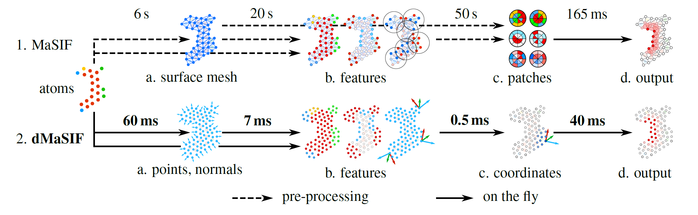

# MaSIF colab

This repo contains a dMaSIF implementation for google colab.
For now we only have a dMaSIF site implementation for visualizing protein binding sites. We are working on other implementations, keep an eye on this repo!

Link to the colab: [dMaSIF_V1](https://colab.research.google.com/github/casperg92/MaSIF_colab/blob/main/dMaSIF_Colab_V1.ipynb)

## Available dMaSIF models

| Models | Resolution | Dimensions | Layers | Radius | ROC/AUC |
| :---------- | ----  | -- | - | ---- | ---- |
| dMaSIF site | 1.0 A | 16 | 3 | 12 A | 0.88 |
| dMaSIF site | 1.0 A | 16 | 3 | 9 A  | 0.88 |
| dMaSIF site | 0.7 A | 16 | 3 | 12 A | 0.88 |
| dMaSIF site | 0.7 A | 16 | 3 | 9 A  | 0.88 |

### Models:
- dMaSIF site identifies protein–protein interaction sites.
- dMaSIF search (COMING SOON!) predicts protein-protein complexes.

### Resolution:
- The distance between points in the pointcloud in Ångström (lower is higher resolution)

### Dimensions:
- The number of embedding dimensions

### Layers:
- Number of convolutional layers

### Radius:
- Radius to use for the convolution

### ROC/AUC:
- Performance measure, higher is better.

### How to run dMaSIF locally
- You can install and run dMaSIF locally throug the [original dMaSIF repository](https://github.com/FreyrS/dMaSIF).

### How to reference this work

- [Sverrisson, F., Feydy, J., Correia, B. E., & Bronstein, M. M. (2021). Fast end-to-end learning on protein surfaces. In Proceedings of the IEEE/CVF Conference on Computer Vision and Pattern Recognition (pp. 15272-15281).](http://dx.doi.org/10.1109/CVPR46437.2021.01502)
